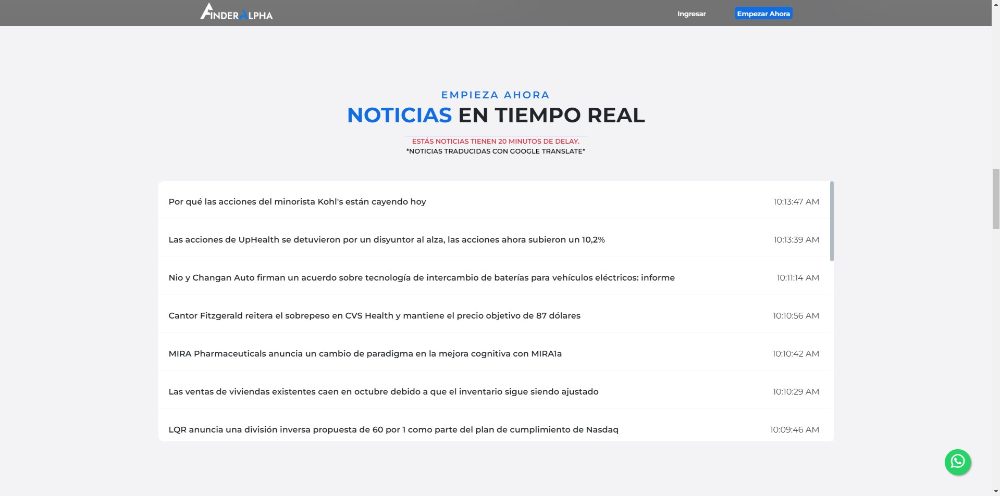
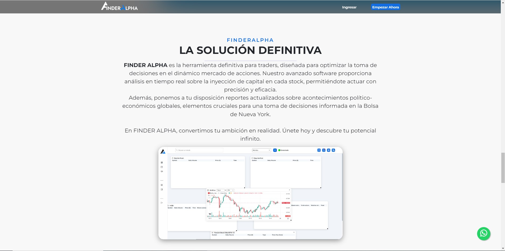
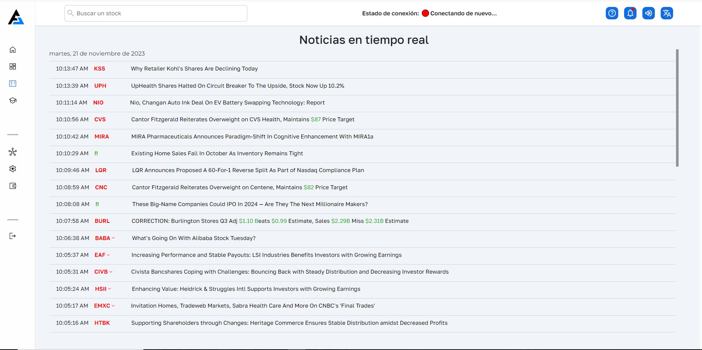
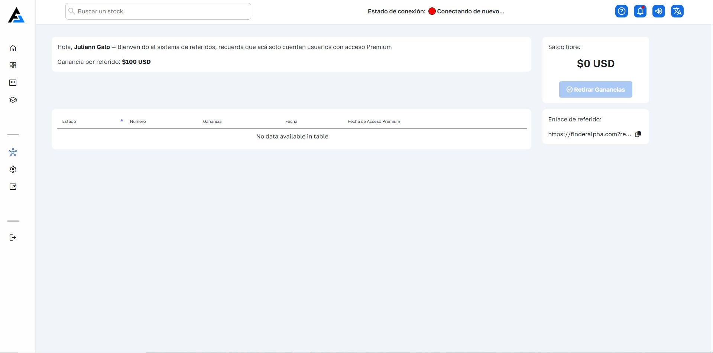

#  Finder Alpha: Definitive Tool for Traders

Finder Alpha is the ultimate tool for traders, designed to optimize decision making in the dynamic stock market. Our advanced software provides real-time analysis of the capital injection into each stock, allowing you to act with precision and efficiency. In addition, we provide you with updated reports on global political-economic events, crucial elements for informed decision-making on the New York Stock Exchange.

At Finder Alpha, we turn your ambition into reality. Join today and discover your infinite potential.

---

### Main Features:

#### Pre-packaged

The pre-market reveals the stocks with the greatest volume and reveals upward gaps (gap up) or downward gaps (gap down). This early insight is essential for intraday trading, providing a privileged look at market dynamics before the open. By understanding which assets are gaining or losing strength, investors can make more informed decisions and capitalize on potential opportunities.

#### Buy Box

Our advanced 'BuyBox' alert system accurately detects when stocks are experiencing a notable capital injection. Through a visual representation in the volume column, which varies in colors from lower to higher shades, we identify clear bullish reversal opportunities in the stock market. This cutting-edge scanner provides solid and timely signals for taking bullish positions, allowing investors to strategically take advantage of growth trends. With 'BuyBox,' investors can make informed decisions and maximize their earning potential in the dynamic world of investing.

#### Sell Box

Our "SellBox" alerts accurately identify when stocks are being oversold or when investors are withdrawing capital from them. Through a visual representation of volume, using a range of colors from low to high, this scanner provides clear signals for short positions in the stock market. This advanced system allows investors to make strategic decisions, capitalizing on bearish trends. With "SellBox," investors can maximize their profit potential by being informed and making informed decisions in a dynamic and competitive market.

---

### Access to the platform

You can enter the platform:

- [FinderAlpha](https://finderalpha.com/)

---

### More of My Work

Here is an additional list of my works and projects:

1. **[Borhood](https://github.com/santiagogalo/Borhood_Oficial):** It is an innovative project in your portfolio that represents a mobile application designed specifically for the taxi sector in Colombia.

2. **[TaxiApp](https://github.com/santiagogalo/TaxiApp):** It is an innovative project in your portfolio that represents a mobile application designed specifically for the taxi sector in Colombia.

3. **[FinderAlpha](https://github.com/santiagogalo/Finderalpha):** is the definitive tool for traders, designed to optimize decision making in the dynamic stock market.

---

### Credits

This project was created and developed by [Santiago Gallo](https://github.com/santiagogalo), Julian Gallo(Laravel, BackEnd) who also came up with the initial prototype.

---

### Contact

You can contact me through the following means:

- Telephone: [Whatsapp](https://api.whatsapp.com/send?phone=573041047207)
- Email: [galo.santiago.g@gmail.com]
- Social networks:
  - [Linkedin](https://www.linkedin.com/in/santiago-gallo-guillen-94a40a264/)

---

### Examples or Demonstrations

    
    
    
    
    

